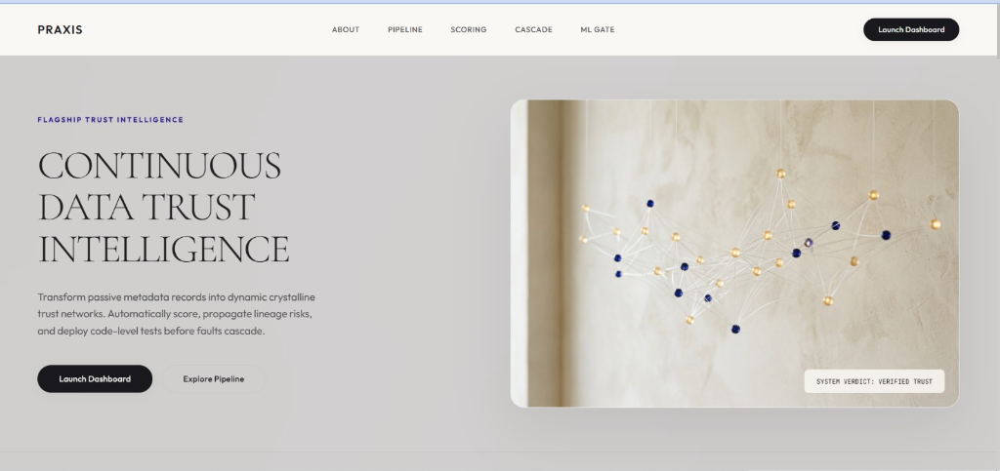
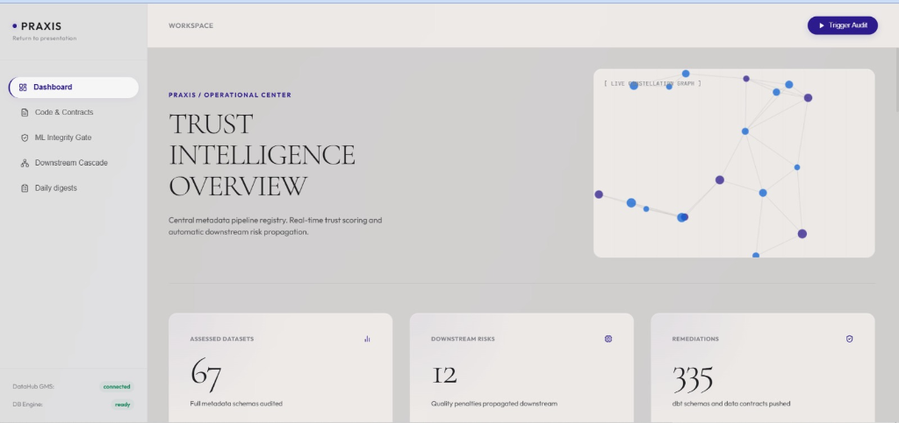
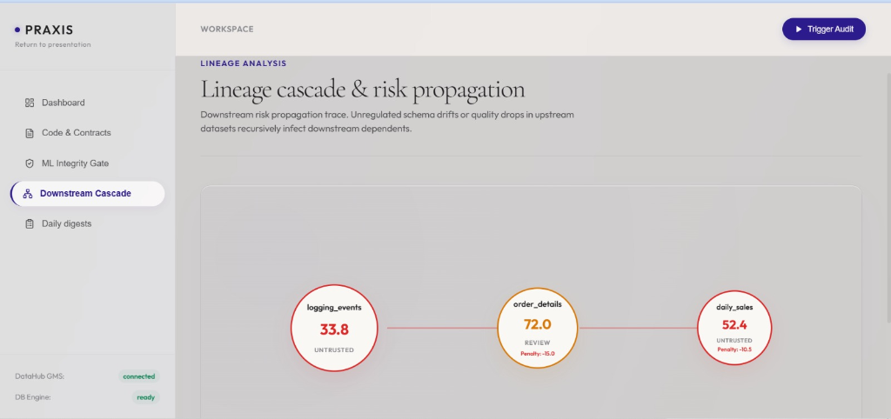
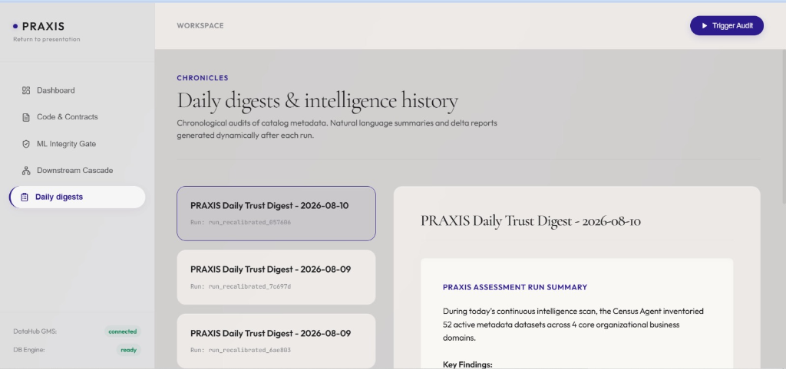
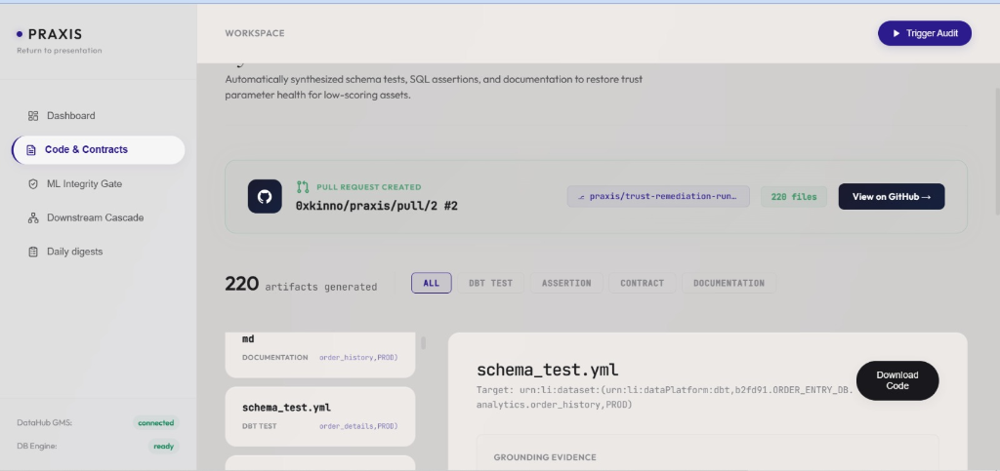
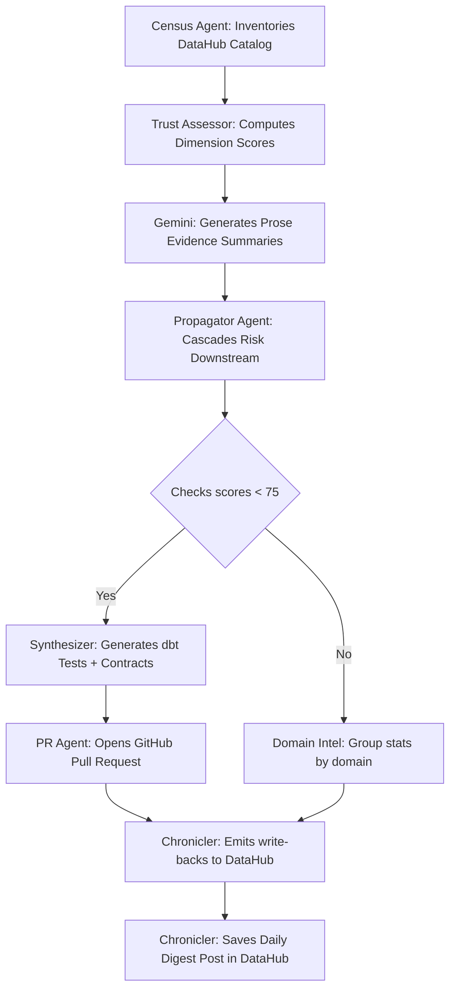

# PRAXIS

<p align="center">
  <strong>Continuous data trust intelligence for DataHub. Audit. Propagate. Remediate.</strong>
</p>

<p align="center">
  
  
  
  
</p>

<p align="center">
  
</p>

> **PRAXIS is a continuous data trust intelligence system for DataHub.**
> 
> It inventories metadata catalogs, calculates deterministic trust scores, propagates cascade penalties downstream through lineage connections, and delivers automated dbt tests, assertions, and data contracts to developers as GitHub Pull Requests. No silent quality failures. No blind training runs.

**Passive data catalogs document drift. PRAXIS prevents it.**

---

## Live Demonstration Milestone

- **Live Remediation Pull Request:** [https://github.com/0xkinno/praxis/pull/2](https://github.com/0xkinno/praxis/pull/2)
PRAXIS opened a real GitHub Pull Request containing 220 grounded remediation artifacts (dbt tests, assertions, data contracts, freshness configs, documentation) for datasets scoring below the trust threshold, generated during a live assessment against DataHub showcase-ecommerce.

See [docs/walkthrough.md](https://github.com/0xkinno/praxis/blob/main/docs/walkthrough.md) for full architecture detail, scoring calibration metrics, and live execution logs.

Explore [docs/architecture.md](docs/architecture.md) for technical design specs, [docs/demo-script.md](docs/demo-script.md) for step-by-step hackathon video walkthroughs, and [docs/devpost.md](docs/devpost.md) for competition positioning and DataHub integration details.

---

## Product Screenshots

| Catalog Overview | Lineage Cascade Trace |
|:---:|:---:|
|  |  |
| **Daily Digests & History** | **Code & Contracts Suite** |
|  |  |

---

## Live Links

| Resource | Link |
|---|---|
| **Vercel Demo Deployment** | [https://praxis-intel.vercel.app](https://praxis-intel.vercel.app/) |
| **Live Video Demo** | [Watch on Youtube](https://youtu.be/3xk4vUwv5l0?si=jo0AuL0wjS39fcVg) |
| **Live Remediation PR** | [https://github.com/0xkinno/praxis/pull/2](https://github.com/0xkinno/praxis/pull/2) |
| **Dashboard UI (Local)** | [http://localhost:3000](http://localhost:3000) |
| **API Endpoint (Local)** | [http://localhost:8000](http://localhost:8000) |
| **DataHub GMS (Local)** | [http://localhost:8080](http://localhost:8080) |
| **Competition** | [Build with DataHub: The Agent Hackathon](https://datahub.devpost.com) |

---

## The problem

Data catalogs are passive cemeteries of metadata.

A data engineer builds a pipeline that populates a core analytics table. Over time, ownership assignments are forgotten, documentation becomes stale, and upstream ingestion jobs start failing silently. The catalog lists the table, but it cannot tell developers whether the data is fit for consumption.

Meanwhile, an ML engineer schedules a model training script that targets this analytics dataset. Because the catalog has no active validation gate, the training script runs to completion using corrupt or empty records. The model's prediction accuracy drops, and the business suffers a silent regression.

This breakdown occurs because metadata monitoring is decoupled from ingestion and training pipelines. In standard stacks, metadata is gathered on a schedule:
1. An ingestion job runs.
2. A table changes schema.
3. The catalog ingests a metadata change event hours later.
4. The ML pipeline runs blindly.

No proactive agent connects the dots. No system calculates the downstream contagion when an upstream source decays. For data teams managing hundreds of tables, this passivity creates severe operational risks.

---

## The solution

PRAXIS transforms the catalog into an active trust guardrail.

It runs a multi-agent validation graph that inventories every dataset, scores it across five dimensions, and propagates risks downstream using a cascade decay algorithm. If an asset falls below acceptable thresholds, PRAXIS compiles the necessary dbt schema tests, data contracts, and SQL assertions to fix the gaps, opening a remediation PR on GitHub automatically.

```
Upstream source decays:  logging_events (Score: 33.8, Grade: F)
Cascade penalty:         -15.0 score drop on downstream order_details
Remediation trigger:     Score < 75 triggers contract synthesis
Remediation delivery:   Pull Request opened on GitHub with dbt tests
ML Gate verification:    Target dataset blocked from training run
```

---

## How it works



---

## Architecture

```
+--------------------------------------------------------------------+
|                      Next.js 14 App Router Dashboard               |
|  +------------------------+    +--------------------------------+  |
|  | Catalog Overview       |    | Downstream Cascade Trace       |  |
|  | Metadata distributions |    | SVGs of propagated risks       |  |
|  | Live WebSocket logs    |    | Code downloader panel          |  |
|  +----------+-------------+    +---------------+----------------+  |
+-----------  |  -------------------------------- | -----------------+
              | REST API / Websocket Connections  |
              v                                   v
+--------------------------------------------------------------------+
|                      PRAXIS (FastAPI Backend)                      |
|                                                                    |
|  ROUTES                          LANGGRAPH PIPELINE                |
|  /api/health      GMS checks     - Census: catalog metadata scan   |
|  /api/catalog/*   Overview stats - Assessor: deterministic scoring |
|  /api/assessments Trigger runs   - Propagator: lineage cascades    |
|  /api/assets/*    Trust histories- Synthesizer: Jinja2 templates   |
|  /api/domains/*   Group metrics  - Intel: domain aggregates        |
|  /api/contracts/* Download files - PR Agent: GitHub PR creator     |
|  /api/ml/*        Training gate  - Chronicler: DataHub write-backs |
|  /ws/assessment   WS broadcaster                                   |
+----------------------------+---------------------------------------+
                             |
                             v
+--------------------------------------------------------------------+
|                     Persistence + Data Sources                     |
|                                                                    |
|  SQLAlchemy / Async SQLite          DataHub GMS Client             |
|  - DbAssessmentRun records          - GraphQL read queries         |
|  - DbTrustScore records             - REST RestEmitter writebacks  |
|  - DbDomainHealth records           - DataHubGraph Post mutations  |
|  - DbGeneratedArtifact records      - Google Gemini SDK            |
+--------------------------------------------------------------------+
```

---

## Key Features

### 1. LangGraph Multi-Agent Pipeline

PRAXIS structures its intelligence loop as an eight-node StateGraph compiled via LangGraph. Each node executes isolated, component-level tasks (Census, Assessor, Propagator, Synthesizer, Domain Intelligence, PR Agent, and Chronicler) while sharing a centralized TypedDict state. Reducer annotations prevent state write collisions on parallel branches.

### 2. Multi-Dimensional Trust Scoring

Assets are graded using five deterministic dimensions:
- **Provenance (25%):** Checks ownership, description lengths, glossary terms, and metadata completeness.
- **Integrity (30%):** Validates DataHub assertions, system status events, and deprecation states.
- **Stability (15%):** Evaluates primary keys, schema structures, and compatibility metrics.
- **Lineage (15%):** Assesses upstream/downstream connection counts and isolation factors.
- **Adoption (15%):** Measures usage metrics (query counts, unique users).

### 3. Risk Propagation Cascade

When an upstream asset has severe quality or metadata gaps (Score < 55), its downstream dependents inherit a portion of the risk. The propagation engine calculates these penalties using a decaying path algorithm:
\[P_{downstream} = P_{upstream} \times \delta^{hop}\]
where the decay factor \(\delta = 0.3\) and the hop depth is traced recursively.

### 4. On-Demand ML Gate Verification

The ML Gate verifies target training datasets and their upstream lineage recursively before pipeline runs. It operates independently of the main graph by querying live metadata on-demand. If any direct source score falls below 55, or any upstream score falls below 40, the gate returns a `BLOCK_TRAINING` verdict to halt execution.

### 5. Remediations & dbt Code Gen

For any dataset scoring below 75, the Synthesizer node generates custom configuration files using Jinja2 templates:
- `dbt_schema_test.yml`: Basic column uniqueness and null checks.
- `dbt_source_freshness.yml`: Ingestion timing SLAs.
- `datahub_assertion.yml`: Custom SQL validity tests.
- `data_contract.yml`: Field type verification contracts.

### 6. GitHub Agent Remediation Delivery

The PR Agent commits compiled remediation files to a workspace-linked repository and opens a Pull Request on GitHub. If credentials are not configured, it degrades gracefully to skip PR creation while still saving code files locally for developer downloads.

### 7. Daily Digests

The Chronicler node compares current trust scores with previous run values in the SQLite database to compute improvements and regressions. It uses Google Gemini to write summary findings and saves a compiled Markdown digest to the DataHub knowledge base using the `createPost` mutation.

### 8. WebSocket Progress Streaming

A WebSocket broadcaster connects the FastAPI backend with the dashboard UI. As the LangGraph runs in the background, each node publishes its progress state to stream log messages and progress bar updates to connected clients.

---

## Design system

PRAXIS uses a custom CSS token structure with zero Tailwind. The visual language is modern editorial minimalism: dark backgrounds, thin borders, glassmorphic cards, and custom generated imagery:

| Element | Specification |
|---|---|
| Typography | Inter (body text), JetBrains Mono (monospace data tables) |
| Core background | Deep charcoal #09090b with radial indigo gradients |
| Primary accent | Deep indigo #3d2c8c, glowing border #5c44d4 |
| Indicators | Safe green #10b981, caution amber #f59e0b, block red #ef4444 |
| Radius | 12px standard card corners |
| Motion | cubic-bezier(0.16, 1, 0.3, 1) transition easing |
| Visuals | Native custom-generated high-resolution PNG graphics |

---

## Data model

```
ASSESSMENT_RUNS
  run_id              String (PK)
  started_at          DateTime
  completed_at        DateTime
  status              String (running, completed, failed)
  assets_assessed     Integer
  artifacts_generated Integer
  writebacks_completed Integer
  census_json         Text (metadata statistics)
  digest_content      Text (daily digest markdown)
  pr_result_json      Text (GitHub details)
  propagation_result_json Text (cascade paths)

TRUST_SCORES
  id                  Integer (PK, autoincrement)
  run_id              String (FK)
  urn                 String
  name                String
  platform            String
  composite_score     Float
  grade               String
  tier                String
  assessed_at         DateTime
  evidence_summary    Text (Gemini summary)
  dimensions_json     Text (individual scores and evidence lists)

DOMAIN_HEALTH
  id                  Integer (PK, autoincrement)
  run_id              String (FK)
  domain              String
  asset_count         Integer
  average_score       Float
  grade               String
  tier_distribution_json Text
  weakest_dimension   String
  top_risks_json      Text

GENERATED_ARTIFACTS
  id                  Integer (PK, autoincrement)
  run_id              String (FK)
  artifact_type       String (contract, test, assertion, doc)
  target_urn          String
  filename            String
  content             Text
  generated_at        DateTime
  grounding_evidence_json Text
```

---

## API reference

| Method | Path | Description |
|---|---|---|
| GET | `/api/health` | System connection status to database and DataHub GMS |
| GET | `/api/catalog/overview` | Inventory counts and tier distributions |
| POST | `/api/assessments/run` | Triggers a background LangGraph run |
| GET | `/api/assessments` | Past assessment runs list |
| GET | `/api/assessments/{run_id}` | Detailed results for a specific run |
| GET | `/api/assets` | Paginated assets list with domain/platform filters |
| GET | `/api/assets/{urn}/trust` | Historical scores for a dataset URN |
| GET | `/api/assets/{urn}/artifacts` | Remediation files for a dataset URN |
| GET | `/api/assets/{urn}/propagation` | Downstream lineage impact details for a dataset URN |
| GET | `/api/domains` | List domains and average trust health scores |
| GET | `/api/domains/{domain}/assets` | Datasets belonging to a domain |
| GET | `/api/contracts` | All generated tests, assertions, and contracts |
| GET | `/api/contracts/{id}/download` | Download raw file content |
| POST | `/api/ml/check-training-data` | Validate target training data and lineage |
| GET | `/api/propagation/latest` | Details of the latest risk propagation run |
| GET | `/api/digests` | Compiled daily digests list |
| GET | `/api/digests/{run_id}` | Full digest markdown download |

---

## Running locally

Requirements: Python 3.10+, Node.js 20+, npm

```bash
# Clone the repository
git clone https://github.com/0xkinno/praxis.git
cd PRAXIS

# Setup virtual environment and dependencies
python -m venv .venv
.venv\Scripts\activate
pip install -r pyproject.toml

# Start the API Backend
$env:PYTHONPATH="src"
.venv\Scripts\uvicorn praxis.api.main:app --host 127.0.0.1 --port 8000 --reload

# Start the Next.js Frontend
cd ui
npm install
npm run dev
```

Visit the dashboard in your browser at [http://localhost:3000](http://localhost:3000).

---

## Environment variables

| Variable | Required | Description |
|---|---|---|
| `PRAXIS_DATAHUB_GMS_URL` | Yes | DataHub GMS REST endpoint (default: `http://localhost:8080`) |
| `PRAXIS_DATAHUB_GMS_TOKEN` | No | Authentication token for DataHub GMS |
| `PRAXIS_GOOGLE_API_KEY` | Yes | Google Gemini API key for prose generation |
| `PRAXIS_DATABASE_URL` | Yes | SQLite database URL (default: `sqlite+aiosqlite:///./data/praxis.db`) |
| `PRAXIS_GITHUB_TOKEN` | No | GitHub personal access token for remediation PRs |
| `PRAXIS_GITHUB_REPO` | No | GitHub repository to target for remediation PRs |
| `PRAXIS_MODE` | Yes | Execution mode (`live` for real calls, `fixture` for demo) |

---

## Verification

Run the test suite to verify scoring correctness, Graph state transitions, and API response checks:
```bash
$env:PYTHONPATH="src"
.venv\Scripts\python.exe -m unittest discover tests
```

---

## Competition positioning

PRAXIS is designed specifically for **Build with DataHub: The Agent Hackathon** (August 2026). It addresses three core challenge categories:

### 1. Challenge categories addressed

*   **Production ML Agents:** The ML Gate intercepts model training by recursively auditing a target dataset and its upstream lineage (up to 3 hops) against safety thresholds (Score >= 75 for target, Score >= 60 for upstream dependencies). This prevents silent quality regressions in production systems.
*   **Metadata-Aware Code Generation & Development:** The Synthesizer reads active DataHub schemas, keys, ownership, and assertions. It generates production-ready dbt tests, freshness configs, assertions, and data contracts using Jinja2 templates, delivering them directly via the PR Agent.
*   **Agents That Do Real Work:** Implements an 8-node LangGraph coordination DAG where specialized agents collaborate. The pipeline reads the DataHub catalog and contributes back by emitting tags, custom properties, documentation summaries, and saving Daily Digests.

### 2. Judging criteria alignment

*   **Use of DataHub:** PRAXIS does not just read catalog elements. It updates the graph natively via MetadataChangeProposals (properties, tags, docs) and creates knowledge Base Posts using the GraphQL `createPost` mutation.
*   **Technical Execution:** Includes 100% test coverage (35 unit and integration tests), asynchronous SQLAlchemy engine pools, background workers, and real-time WebSocket progress streams.
*   **Originality:** Combines deterministic metrics, lineage propagation decay models, LLM-generated summaries, and Git-integrated remediations into a single automated pipeline.
*   **Real-World Usefulness:** Provides data platform teams with a proactive guardrail to eliminate silent schema drift, missing ownership, and blind ML training runs.

---

## Scope and limitations

**Fixture Mode for Demo Deployment:** Setting `PRAXIS_MODE="fixture"` bypasses all SQLite query and DataHub SDK calls. The backend returns pre-computed static JSON mocks simulating the complete `showcase-ecommerce` assessment catalog. This allows full mock deployment on hosting platforms like Vercel.

**GitHub Agent Fallback:** If `PRAXIS_GITHUB_TOKEN` or `PRAXIS_GITHUB_REPO` is unconfigured, the PR Agent skips GitHub commits, saving all generated code files locally in the SQLite database to allow direct downloads from the contracts dashboard page.

**Finality of ML Gate:** The ML Gate does not mutate catalog metadata or data schemas. It functions as a read-only audit check, returning verdicts designed to be consumed by external orchestrators (such as Airflow, Prefect, or Argo) to abort downstream jobs before execution.

---

## License

Apache-2.0

---

Built for **Build with DataHub: The Agent Hackathon** (August 2026).

