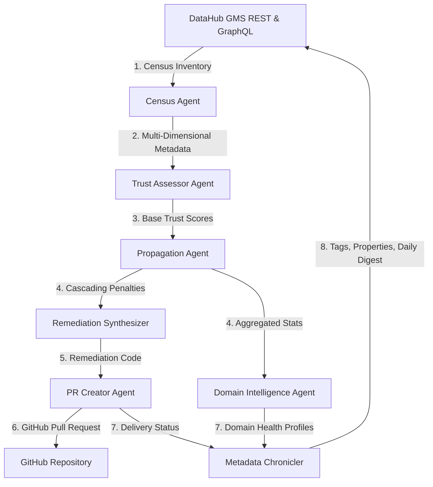

# PRAXIS System Architecture

PRAXIS is a data trust intelligence system designed for DataHub. It implements a multi-agent system built on top of LangGraph that inventories datasets, calculates multidimensional trust scores, propagates low-trust penalties down lineage graphs, synthesizes remediation code (dbt tests and data contracts), opens pull requests on GitHub, and writes back metadata insights directly into DataHub GMS.

## Component Overview

### 1. Core Agents
- **Census Agent**: Queries DataHub GMS using GraphQL to find all dataset entities. Collects core details, ownership, schemas, tags, glossary terms, health statistics, assertions, and usage metrics.
- **Trust Assessor Agent**: Evaluates every dataset across five deterministic dimensions:
  1. *Provenance*: Assesses ownership presence and description completeness.
  2. *Integrity*: Examines assertion runs and recent test pass rates.
  3. *Stability*: Checks primary keys, schema complexity, and deprecation status.
  4. *Lineage*: Analyzes upstream inputs and connections.
  5. *Adoption*: Inspects monthly usage queries and unique user counts.
  Generates a natural language summary of findings and gaps using the Google Gemini API (gemini-2.5-flash) with an automatic rule-based fallback.
- **Propagation Agent**: Traverses the downstream lineage graph. If an upstream asset has a trust score below the threshold, it applies a staggering penalty factor ($0.3$ by default) to all downstream descendants.
- **Remediation Synthesizer**: Generates Jinja2-templated dbt tests, source freshness checks, DataHub assertions, and data contracts (in YAML/YAML-Schema) for all low-trust datasets.
- **PR Agent**: Git-stages the generated remediation files, pushes them to a new branch, and opens a GitHub Pull Request (degrades gracefully to local logging if tokens are missing).
- **Domain Intelligence Agent**: Groups assets by their DataHub domains and computes domain-level compliance profiles (grade distribution, weakest dimensions, and top security risks).
- **Metadata Chronicler**: Performs live writebacks to DataHub (adds `praxis-trusted`/`praxis-review`/`praxis-untrusted` tags, saves composite scores and dimensions as custom properties, and creates a markdown "Daily Digest" post on the DataHub Home Page).

### 2. Independent Modules
- **ML Gate**: An API endpoint that allows ML engineers to paste a list of dataset URNs. It traces lineage up to $3$ hops, calculates risk scores, and outputs a verdict (`SAFE_TO_TRAIN`, `CAUTION`, or `BLOCK_TRAINING`) before pipeline execution.

## Data Model (SQLite Schema)

PRAXIS stores historical run logs and granular scores in a local SQLite database (`data/praxis.db`):

- **`assessment_runs`**: Tracks pipeline execution metadata (run ID, started/completed time, census statistics, digest text, and PR details).
- **`trust_scores`**: Holds individual asset scoring details, including scores for all five dimensions, overall grade, trust tier, and Gemini evidence summary.
- **`domain_health`**: Stores compliance profiles and average grades aggregated per DataHub domain.
- **`generated_artifacts`**: Contains the full text of all dbt schemas, data contracts, and docs generated for remediation.

## Technology Stack

- **Backend**: FastAPI, Uvicorn, LangGraph, SQLAlchemy (Async), Google GenAI SDK, PyGithub, Jinja2.
- **Frontend**: Next.js 14 (App Router), TypeScript, Framer Motion (staggered cascade animations), Tailwind CSS.
- **Integration**: DataHub REST & GraphQL APIs (via `acryl-datahub`).
