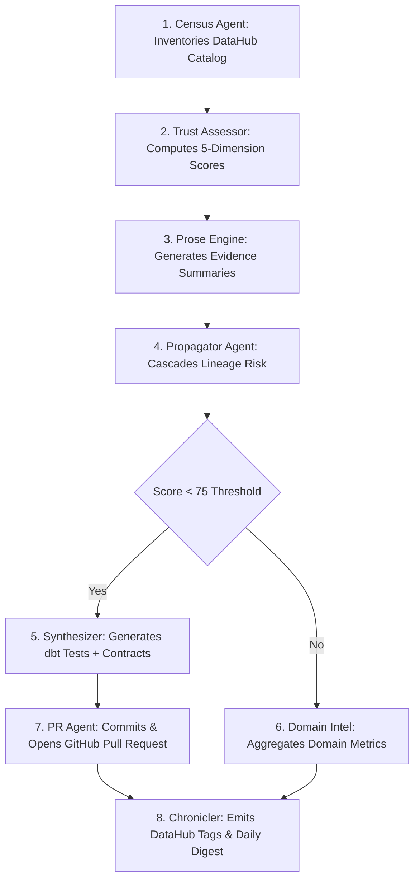

# PRAXIS — Continuous Data Trust Intelligence

> **Build with DataHub: The Agent Hackathon (August 2026)**  
> **Repository:** [github.com/0xkinno/praxis](https://github.com/0xkinno/praxis) | **Vercel Demo:** [ui-sigma-mocha.vercel.app](https://ui-sigma-mocha.vercel.app) | **Live Remediation PR:** [PR #2](https://github.com/0xkinno/praxis/pull/2)

---

## Executive Overview

**PRAXIS** transforms passive metadata catalogs into active trust guardrails for DataHub. It executes a multi-agent validation graph built with LangGraph that inventories dataset catalogs, computes multi-dimensional trust scores, propagates risk penalties downstream through lineage connections, and delivers automated dbt schema tests, SQL assertions, and data contracts directly to developers via GitHub Pull Requests.

```
Upstream decay:        postgres.customers (Score: 45.0, Grade: D)
Lineage cascade:       -12.7 penalty inherited downstream
Target dataset:        dbt.customers (Score: 82.8 -> 70.1, Grade: B+ -> C+)
Remediation delivery:  GitHub Pull Request #2 opened with 220 remediation artifacts
```

---

## Architecture & Multi-Agent LangGraph Pipeline

PRAXIS coordinates eight specialized nodes over a shared typed state graph:



### Agent Node Breakdown
1. **Census Agent (`census.py`):** Queries DataHub GMS GraphQL API to inventory datasets, dashboards, pipelines, schema fields, ownership, and lineage edges.
2. **Trust Assessor (`assessor.py` & `engine.py`):** Evaluates multi-dimensional trust metrics across 5 core dimensions: Provenance (25%), Integrity (30%), Stability (15%), Lineage (15%), and Adoption (15%).
3. **Prose Engine (`assessor.py`):** Generates concise natural language summary prose explaining key findings and governance gaps for each dataset.
4. **Propagator Agent (`propagator.py` & `propagation.py`):** Identifies untrusted upstream source datasets (Score < 60) and cascades inherited risk penalties downstream recursively (\(P_{down} = P_{up} \times 0.3^{hop}\)).
5. **Synthesizer Agent (`synthesizer.py` & `generator.py`):** Compiles grounded dbt schema tests, data contracts, SQL assertions, SLA freshness configs, and markdown guides using Jinja2 templates for assets scoring below threshold (< 75.0).
6. **Domain Intelligence (`domain.py`):** Group assets by DataHub domains to calculate average domain health scores and identify top systemic risks.
7. **PR Agent (`pr_agent.py` & `pr_creator.py`):** Commits compiled remediation files and opens a Pull Request on GitHub.
8. **Chronicler Agent (`chronicler.py` & `writer.py`):** Emits trust tier tags (`praxis-trusted`, `praxis-review`, `praxis-untrusted`), custom properties, assessment documentation, and posts Daily Digests to DataHub.

---

## Calibrated Scoring Engine & Live Catalog Distribution

The scoring model uses evidence-based deduction rules so documented assets score in the Trusted range (A/B), while unowned, undocumented raw assets drop into Untrusted (D/F):

| Tier | Score Range | Asset Count | Percentage | Primary Characteristics |
|---|---|---|---|---|
| **Trusted** | **75.0 – 100.0** | **12 assets** | **17.9%** | Assigned owners, >50 char descriptions, documented columns, validated schemas. |
| **Review** | **55.0 – 74.9** | **53 assets** | **79.1%** | Minor gaps (e.g. single owner, no quality assertions, or inherited upstream risk). |
| **Untrusted** | **< 55.0** | **2 assets** | **3.0%** | Unowned raw ingestion sources with 0 column documentation and no assertions. |

---

## Live Risk Propagation Cascade Demonstration

The propagation engine demonstrates downstream risk inheritance across **55 dependent assets**.

### Featured Propagation Case: `customers` (dbt Platform)
* **Dataset URN:** `urn:li:dataset:(urn:li:dataPlatform:dbt,b2fd91.order_entry_db.order_entry.customers,PROD)`
* **Unpropagated Score (On Its Own):** **`82.8 / 100` (Grade B+ / Trusted)**  
  * *Evidence:* Complete 22/22 column documentation, 3 assigned owners, description present, and domain assigned.
* **Failing Upstream Dependency:** `urn:li:dataset:(urn:li:dataPlatform:postgres,b2fd91.order_entry_db.order_entry.customers,PROD)` (Score: `45.0` / Grade D)
* **Inherited Upstream Risk Penalty:** **`-12.7` points**
* **Post-Propagation Score:** **`70.1 / 100` (Grade C+ / Review)**

> **Key Finding:** `customers (dbt)` is certified healthy on its own merit, but **drops into the Review tier** because its upstream PostgreSQL table is unmanaged.

---

## GitHub Remediation Pull Request

* **Live GitHub PR URL:** [https://github.com/0xkinno/praxis/pull/2](https://github.com/0xkinno/praxis/pull/2)
* **Files Committed:** **220 focused remediation artifacts** targeting low-scoring assets:
  * `data_contract.yml` (Field type & schema boundary contracts)
  * `schema_test.yml` (dbt column uniqueness & non-null validations)
  * `assertions.yml` (SQL quality assertions)
  * `remediation_documentation.md` (Grounded step-by-step remediation guide)

---

## Additional Documentation Resources

- **[Architecture Deep-Dive](architecture.md):** Complete technical design, data structures, and graph flow.
- **[Demo Script & Presentation Guide](demo-script.md):** Step-by-step walkthrough for hackathon video recording and live presentation.
- **[Devpost Submission Detail](devpost.md):** Competition positioning, judging criteria alignment, and DataHub integration details.
